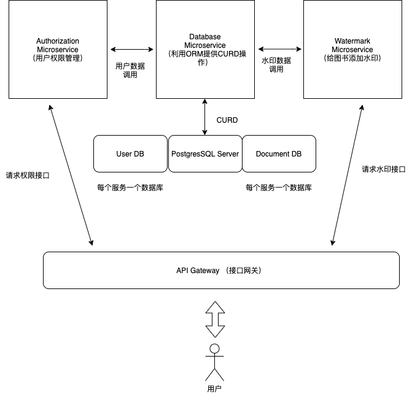

# Publisher (出版社图书出版添加水印)

以微服务(Microservices)架构为前提，利用 go-kit 开发三个节点（水印 Watermark、权限 Authorization、数据库 Database），实现节点之间 HTTP 和 RPC 两种模式通信和连接。

<!-- ## 项目架构 -->

## 技术栈



## 项目结构

项目结构跟随 Golang 项目构建标准.

- api -> 存储 API 版本文件和 gRPC protobuf 生成的 proto 和 pb 接口文件。
- cmd -> 包含命令行启动项目的 Main 文件。
- docs -> 项目的介绍和接口文档。
- config -> 项目配置文件。
- deploy -> 服务器部署文件。
- internal -> 核心模型文件。
- pkg -> 业务代码逻辑的具体实现和向外部开放接口。
- tests -> 项目代码测试文件。
- vendor -> 第三方依赖库文件。

## 项目依赖

罗列重要的库依赖：

```
github.com/go-kit/kit
github.com/go-kit/log
github.com/go-logfmt/logfmt
github.com/golang/protobuf
github.com/google/uuid v1.3.0
google.golang.org/genproto
google.golang.org/grpc
google.golang.org/protobuf v1.27.1
github.com/jackc/pgproto3/v2 v2.1.1
gorm.io/driver/postgres v1.1.2
gorm.io/gorm v1.21.16
```